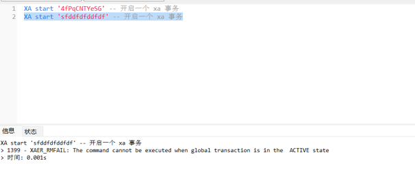

## 运行mysql服务

```shell
docker-compose up -d mysql
```

## 运行dtm服务

```shell
cd dtm
go mod tidy
go run main.go -c dtm_conf.yml
```

## 启动聚合服务

```shell
cd xa/aggregation
go mod tidy
go run main.go
```

## 启动服务A

```shell
cd xa/service_a
go mod tidy
go run main.go
```

## 启动服务B

```shell
cd xa/service_b
go mod tidy
go run main.go
```

## 测试事务提交

```shell
curl http://127.0.0.1:5000/testJobCommit
```

#### 可以看到service_a.a、service_b.b会各新增一条记录

## 测试事务回滚

```shell
curl http://127.0.0.1:5000/testJobRollback
```

#### service_a.a、service_b.b都没有新增记录

## 注意事项

### XA事务的 begin 与 commit/rollback 必须在一个连接中

> ref: https://github.com/dtm-labs/dtm/issues/334
>
